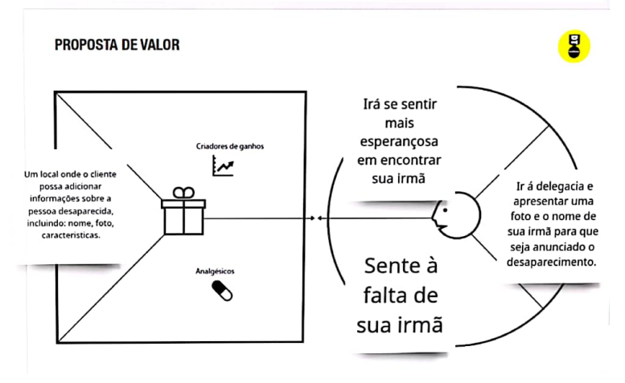
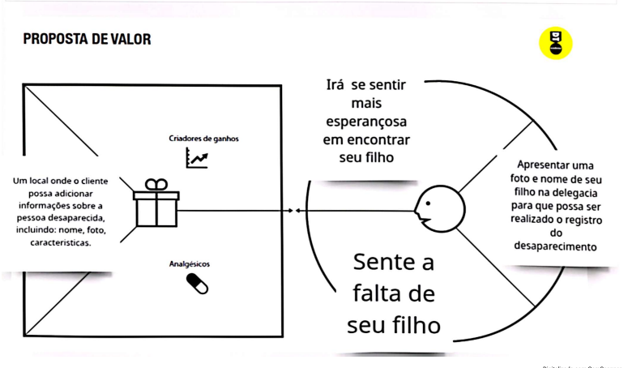
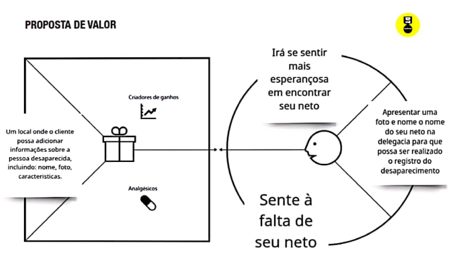
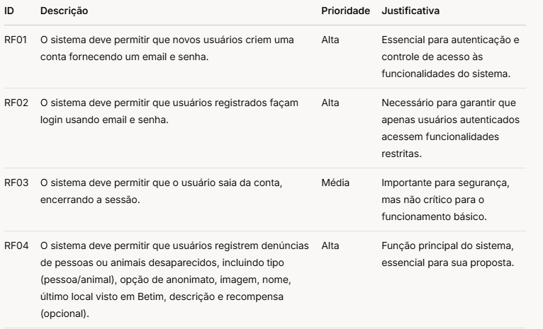
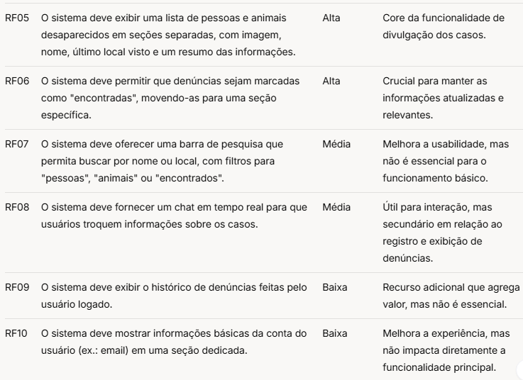
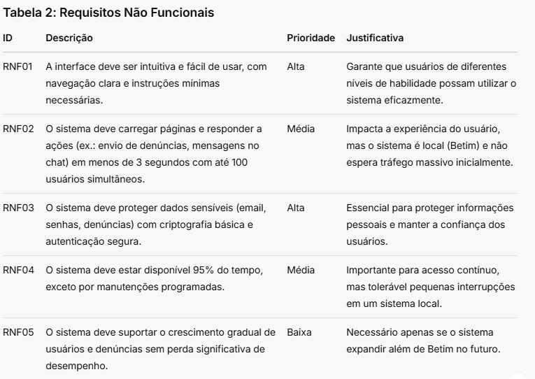
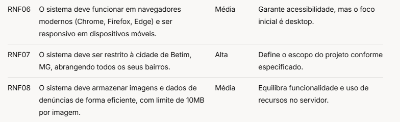
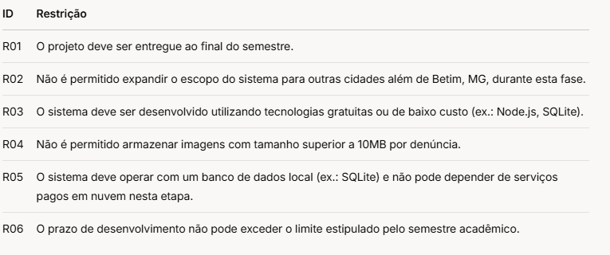

# Product design

Pré-requisitos: <a href="02-Product-discovery.md"> Product discovery</a>

Neste momento, transformam-se os insights e validações obtidos em soluções tangíveis e utilizáveis. Esta fase envolve a definição de uma proposta de valor, detalhando a prioridade de cada ideia, e a consequente criação de wireframes, mockups e protótipos de alta fidelidade, que especificam a interface e a experiência do usuário.

## Histórias de usuários

Com base na análise das personas, foram identificadas as seguintes histórias de usuários:

|EU COMO... `PERSONA`| QUERO/PRECISO ... `FUNCIONALIDADE` |PARA ... `MOTIVO/VALOR`                 |
|--------------------|------------------------------------|----------------------------------------|
|Usuário do sistema  | Registrar minhas tarefas  ⚠️ EXEMPLO ⚠️         | Não esquecer de fazê-las               |
|Administrador       | Alterar permissões        ⚠️ EXEMPLO ⚠️         | Permitir que possam administrar contas |

> ⚠️ **APAGUE ESTA PARTE ANTES DE ENTREGAR SEU TRABALHO**

Apresente aqui as histórias de usuários que são relevantes para o projeto da sua solução. As histórias de usuários consistem em uma ferramenta poderosa para a compreensão e elicitação dos requisitos funcionais e não funcionais da sua aplicação. Se possível, agrupe as histórias de usuários por contexto, para facilitar consultas recorrentes a esta parte do documento.

> **Links úteis**:
> - [Histórias de usuários com exemplos e template](https://www.atlassian.com/br/agile/project-management/user-stories)
> - [Como escrever boas histórias de usuário (user stories)](https://medium.com/vertice/como-escrever-boas-users-stories-hist%C3%B3rias-de-usu%C3%A1rios-b29c75043fac)
> - [User stories: requisitos que humanos entendem](https://www.luiztools.com.br/post/user-stories-descricao-de-requisitos-que-humanos-entendem/)
> - [Histórias de usuários: mais exemplos](https://www.reqview.com/doc/user-stories-example.html)
> - [9 common user story mistakes](https://airfocus.com/blog/user-story-mistakes/)

## Proposta de valor

PROPOSTA DE VALOR PERSONA 1: 
PROPOSTA DE VALOR PERSONA 2: 
PROPOSTA DE VALOR PERSONA 3: 

> **Links úteis**:
> - [O que é o canvas da proposta de valor e como usar?](https://www.youtube.com/watch?v=Iqb-8Q_eiiA)

## Requisitos

As tabelas a seguir apresentam os requisitos funcionais e não funcionais que detalham o escopo do projeto. Para determinar a prioridade dos requisitos, aplique uma técnica de priorização e detalhe como essa técnica foi aplicada.

### Requisitos funcionais
, 

### Requisitos não funcionais
, 

> **Links úteis**:
> - [O que são requisitos funcionais e requisitos não funcionais?](https://codificar.com.br/requisitos-funcionais-nao-funcionais/)
> - [Entenda o que são requisitos de software, a diferença entre requisito funcional e não funcional, e como identificar e documentar cada um deles](https://analisederequisitos.com.br/requisitos-funcionais-e-requisitos-nao-funcionais-o-que-sao/)

## Restrições

TABELA RESTRIÇÕES: 