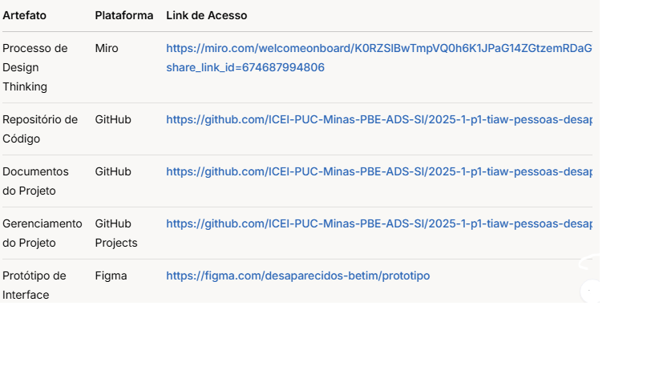

# Metodologia

Pré-requisitos: <a href="03-Product-design.md"> Product design</a>

Organização da Equipe e Divisão de Papéis
Gerente de Projeto: Lucas Marinho Blon Rocha
Designer de ui e ux: Responsável pela criação da interface e experiência do usuário.
Desenvolvedor Frontend: Responsável pela implementação da interface.
Desenvolvedor Back-end: Responsável pela lógica do servidor e banco de dados.
Tester: Responsável por garantir a qualidade e funcionalidade da plataforma.
Consultor Legal: Responsável por garantir que a plataforma esteja em conformidade com as leis de privacidade e proteção de dados.
Quadro de Controle de Tarefas - Kanban
A Fazer: Listagem de tarefas pendentes, como desenvolvimento de funcionalidades e design de telas.
Em Progresso: Tarefas atualmente em desenvolvimento, como testes de usabilidade e integração de sistemas.
Concluído: Tarefas finalizadas e testadas, prontas para serem lançadas.

## Relação de ambientes de trabalho

Os artefatos do projeto são desenvolvidos a partir de diversas plataformas. A relação dos ambientes com seus respectivos propósitos deverá ser apresentada em uma tabela que especifique e detalhe Ambiente, Plataforma e Link de Acesso. Defina também os ambientes e frameworks que serão utilizados no desenvolvimento de aplicações móveis.

## Controle de versão

A ferramenta de controle de versão adotada no projeto foi o [Git](https://git-scm.com/), sendo que o [GitHub](https://github.com) foi utilizado para hospedagem do repositório.

O projeto segue a seguinte convenção para o nome de branches:

- `main`: versão estável já testada do software
- `unstable`: versão já testada do software, porém instável
- `testing`: versão em testes do software
- `dev`: versão de desenvolvimento do software

Quanto à gerência de issues, o projeto adota a seguinte convenção para etiquetas:

- `documentation`: melhorias ou acréscimos à documentação
- `bug`: uma funcionalidade encontra-se com problemas
- `enhancement`: uma funcionalidade precisa ser melhorada
- `feature`: uma nova funcionalidade precisa ser introduzida

Discuta como a configuração do projeto foi feita na ferramenta de versionamento escolhida. Exponha como a gestão de tags, merges, commits e branches é realizada. Discuta também como a gestão de issues foi feita.

> **Links úteis**:
> - [Tutorial GitHub](https://guides.github.com/activities/hello-world/)
> - [Git e GitHub](https://www.youtube.com/playlist?list=PLHz_AreHm4dm7ZULPAmadvNhH6vk9oNZA)
> - [Comparando fluxos de trabalho](https://www.atlassian.com/br/git/tutorials/comparing-workflows)
> - [Understanding the GitHub flow](https://guides.github.com/introduction/flow/)
> - [The gitflow workflow - in less than 5 mins](https://www.youtube.com/watch?v=1SXpE08hvGs)

## Planejamento do projeto

###  Divisão de papéis

- Scrum Master: Lucas Marinho Blon Rocha
- Product Owner: Matheus Souto dos Santos
- Equipe de Desenvolvimento: Lucas Marinho Blon Rocha, Matheus Souto dos Santos, João Witor da Silva Moura, Júlio César Matos Medeiros Filho, Lucas Vinicius de Castro Oliveira	
- Equipe de Design:Lucas Marinho Blon Rocha, Matheus Souto dos Santos, João Witor da Silva Moura, Júlio César Matos Medeiros Filho, Lucas Vinicius de Castro Oliveira	

> **Links úteis**:
> - [11 passos essenciais para implantar Scrum no seu projeto](https://mindmaster.com.br/scrum-11-passos/)
> - [Scrum em 9 minutos](https://www.youtube.com/watch?v=XfvQWnRgxG0)
> - [Os papéis do Scrum e a verdade sobre cargos nessa técnica](https://www.atlassian.com/br/agile/scrum/roles)

### Processo

> ⚠️ **APAGUE ESTA PARTE ANTES DE ENTREGAR SEU TRABALHO**

Coloque detalhes sobre o processo de Design Thinking e a implementação do Framework Scrum seguido pelo grupo. O grupo deverá fazer uso do recurso de gerenciamento de projeto oferecido pelo GitHub, o GitHub Projects, que permite acompanhar o andamento do projeto, a execução das tarefas e o status de desenvolvimento da solução. 

Coloque uma imagem da estrutura da ferramenta de controle de tarefas (Kanban) e o link do GitHub Projects.
 
> **Links úteis**:
> - [GitHub Projects - YouTube](https://www.youtube.com/playlist?list=PLiO7XHcmTsldZR93nkTFmmWbCEVF_8F5H)
> - [Planejamento e gestão ágil de projetos](https://pucminas.instructure.com/courses/87878/pages/unidade-2-tema-2-utilizacao-de-ferramentas-para-controle-de-versoes-de-software)
> - [Sobre quadros de projeto](https://docs.github.com/pt/issues/organizing-your-work-with-project-boards/managing-project-boards/about-project-boards)
> - [Project management, made simple](https://github.com/features/project-management/)
> - [Como criar backlogs no GitHub](https://www.youtube.com/watch?v=RXEy6CFu9Hk)
> - [Tutorial slack](https://slack.com/intl/en-br/)

### Ferramentas

ARTEFATOS DO PROJETO: 
