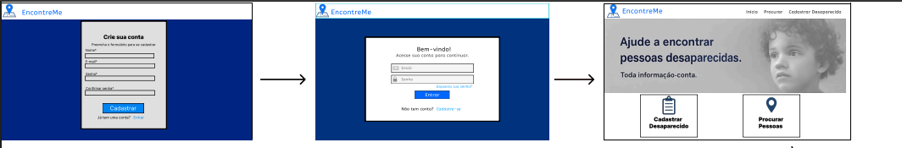
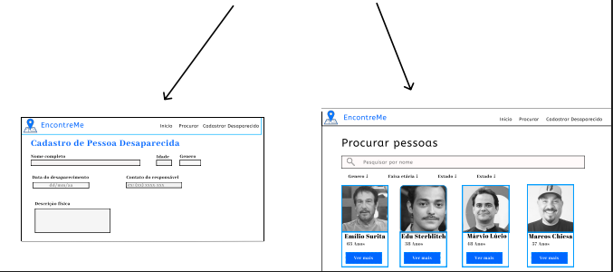
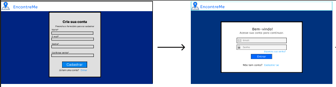
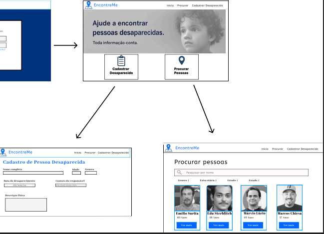

# Projeto de interface

Pré-requisitos: <a href="03-Product-design.md"> product design</a>

 
 ## User flow

> **Links úteis**:
> - [User flow: o quê é e como fazer?](https://medium.com/7bits/fluxo-de-usu%C3%A1rio-user-flow-o-que-%C3%A9-como-fazer-79d965872534)
> - [User flow vs site maps](http://designr.com.br/sitemap-e-user-flow-quais-as-diferencas-e-quando-usar-cada-um/)
> - [Top 25 user flow tools & templates for smooth](https://www.mockplus.com/blog/post/user-flow-tools)

## Wireframes

 
> **Links úteis**:
> - [Protótipos: baixa, média ou alta fidelidade?](https://medium.com/ladies-that-ux-br/prot%C3%B3tipos-baixa-m%C3%A9dia-ou-alta-fidelidade-71d897559135)
> - [Protótipos vs wireframes](https://www.nngroup.com/videos/prototypes-vs-wireframes-ux-projects/)
> - [Ferramentas de wireframes](https://rockcontent.com/blog/wireframes/)
> - [Figma](https://www.figma.com/)
> - [MarvelApp](https://marvelapp.com/developers/documentation/tutorials/)
> - [Adobe XD](https://www.adobe.com/br/products/xd.html#scroll)

### Protótipo Interativo

>
> Um protótipo interativo apresenta o projeto das interfaces e permite ao usuário navegar pelas funcionalidades como se estivesse utilizando o software finalizado. Utilize as mesmas ferramentas de criação de wireframes para a montagem do seu protótipo interativo. Inclua o link para o protótipo interativo do projeto.

**✳️✳️✳️ COLOQUE AQUI UM IFRAME COM SEU PROTÓTIPO INTERATIVO ✳️✳️✳️**

✅ [Protótipo interativo](https://marvelapp.com/prototype/4hd6091?emb=1&iosapp=false&frameless=false)  ⚠️ EXEMPLO ⚠️