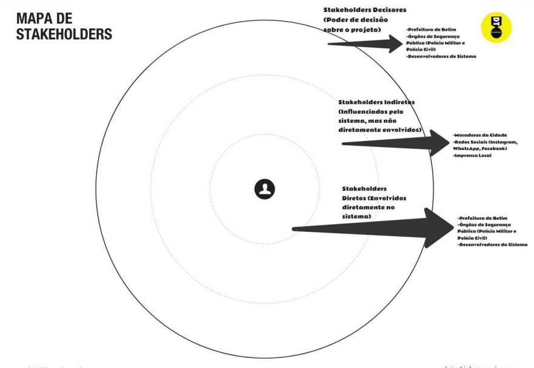
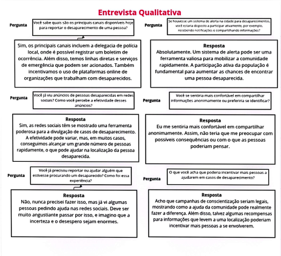
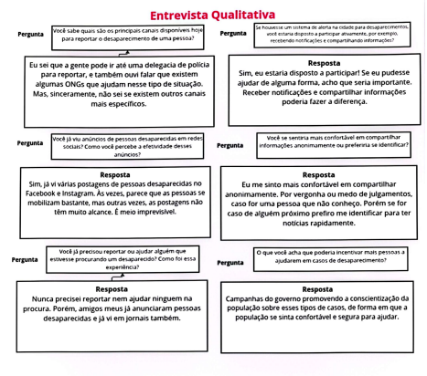
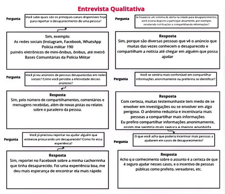
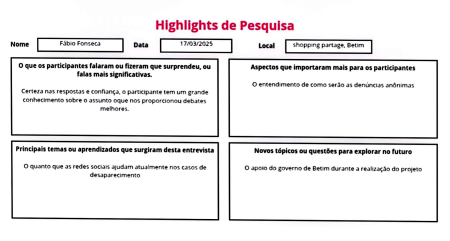
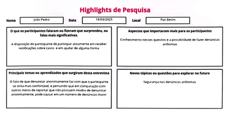
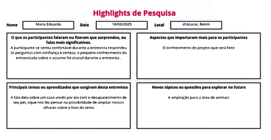
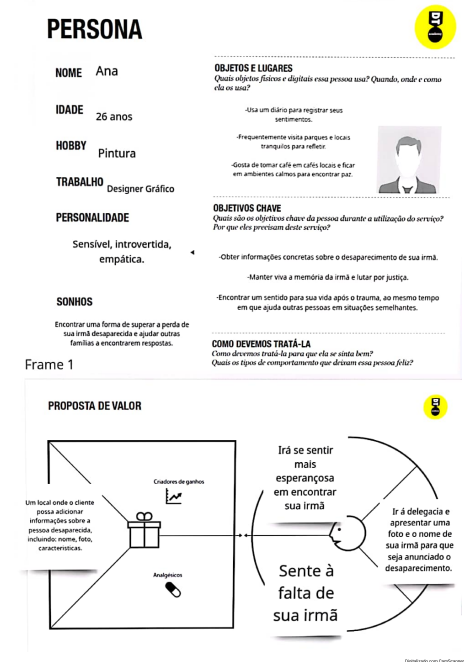
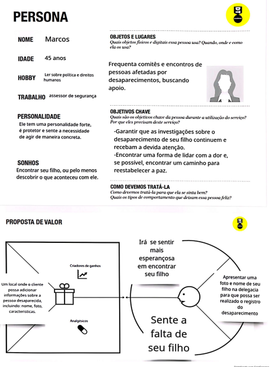
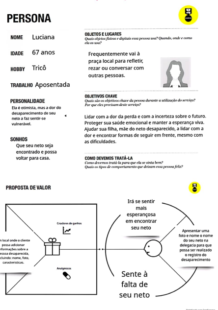

# Product discovery

Pré-requisitos: <a href="01-Contexto.md"> Documentação de contexto</a>

## Etapa de entendimento

> * **Matriz CSD**: 
> * **Mapa de stakeholders**:  
> * **Entrevistas qualitativas**: , , 
> * **Highlights de pesquisa**: , , 

> **Links úteis**:
> - [Mapa de stalkeholders](https://www.racecomunicacao.com.br/blog/como-fazer-o-mapeamento-de-stakeholders/)

## Etapa de definição

### Personas
PERSONA 1:  
PERSONA 2:  
PERSONA 3: 

> **Links úteis**:
> - [Rock Content](https://rockcontent.com/blog/personas/)
> - [Criar personas (Hotmart)](https://blog.hotmart.com/pt-br/como-criar-persona-negocio/)
> - [O que é persona?](https://resultadosdigitais.com.br/blog/persona-o-que-e/)
> - [Persona x público-alvo](https://flammo.com.br/blog/persona-e-publico-alvo-qual-a-diferenca/)
> - [Qual a diferença entre público-alvo e persona?](https://rockcontent.com/blog/diferenca-publico-alvo-e-persona/)
