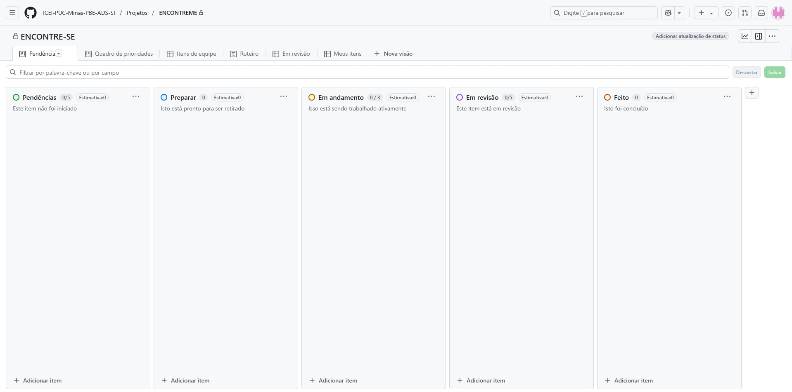
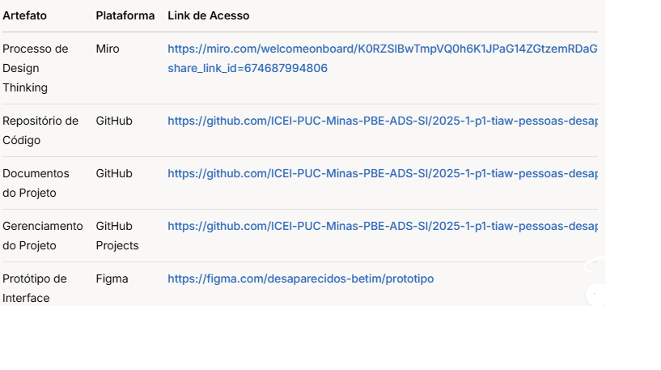

# Metodologia

Pré-requisitos: <a href="03-Product-design.md"> Product design</a>

Organização da Equipe e Divisão de Papéis
Gerente de Projeto: Lucas Marinho Blon Rocha
Designer de ui e ux: Lucas Marinho Blon Rocha/ Matheus Souto 
Desenvolvedor Frontend: Lucas Marinho Blon Rocha
Desenvolvedor Back-end: Guilherme Cândido
Tester: Lucas Vinicius
Consultor Legal: Lucas Vinicius
Quadro de Controle de Tarefas - Kanban
Concluído: Tarefas finalizadas e testadas, prontas para serem lançadas.

## Relação de ambientes de trabalho

Os artefatos do projeto são desenvolvidos a partir de diversas plataformas. A relação dos ambientes com seus respectivos propósitos é apresentada abaixo:

| **Ambiente**       | **Plataforma**   | **Link de Acesso**                     | **Propósito**                                                                 |
|---------------------|------------------|----------------------------------------|-------------------------------------------------------------------------------|
| Repositório de Código | GitHub          | [https://github.com/ICEI-PUC-Minas-PBE-ADS-SI/2025-1-p1-tiaw-pessoas-desaparecidas.git](#)              | Versionamento do código-fonte e colaboração                                   |
| Documentação        | GitHub           | [https://github.com/ICEI-PUC-Minas-PBE-ADS-SI/2025-1-p1-tiaw-pessoas-desaparecidas.git](#)             | Centralização de requisitos, decisões técnicas e documentação do projeto      |
| Design UI/UX        | Figma            | [https://www.figma.com/design/KdgA4h8D3LDyocbCEekv96/Untitled?node-id=0-1&t=k0xFDjMdqvtP3JXR-1](#)                | Prototipagem de interfaces e fluxos de usuário                               |
| Comunicação         | Whatsapp            | Canal privado                         | Comunicação diária da equipe e alinhamentos                                  |
| Gerenciamento       | GitHub Projects  | [https://github.com/orgs/ICEI-PUC-Minas-PBE-ADS-SI/projects/71](#)                  | Acompanhamento de tarefas e sprints                                          |                               |

**Ambientes e frameworks para desenvolvimento móvel**:
- **Frontend**: HTML/CSS/JAVASCRYPT
- **Backend**: Node.js

## Controle de versão

A ferramenta de controle de versão adotada no projeto foi o [Git](https://git-scm.com/), sendo que o [GitHub](https://github.com) foi utilizado para hospedagem do repositório.

O projeto segue a seguinte convenção para o nome de branches:

- `main`: versão estável já testada do software
- `unstable`: versão já testada do software, porém instável
- `testing`: versão em testes do software
- `dev`: versão de desenvolvimento do software

Quanto à gerência de issues, o projeto adota a seguinte convenção para etiquetas:

- `documentation`: melhorias ou acréscimos à documentação
- `bug`: uma funcionalidade encontra-se com problemas
- `enhancement`: uma funcionalidade precisa ser melhorada
- `feature`: uma nova funcionalidade precisa ser introduzida

### Configuração do Projeto no GitHub
1. **Branches**:
   - Feature branches são criadas a partir de `dev` (ex: `feat/login`).
   - Merge em `main` apenas via Pull Request aprovado.
2. **Tags**: Versões estáveis marcadas com `git tag v1.0.0`.
3. **Automações**:
   - GitHub Actions para testes em cada PR.
   - Branch protection em `main` e `dev`.

### Gestão de Issues
- **Templates**: Modelos padronizados para bugs e features.
- **Atribuição**: Issues associadas a membros específicos.
- **Rastreamento**: Labels usadas para filtrar por prioridade.

## Planejamento do projeto

### Divisão de papéis

- Scrum Master: Lucas Marinho Blon Rocha
- Product Owner: Matheus Souto dos Santos
- Equipe de Desenvolvimento: Lucas Marinho Blon Rocha, Matheus Souto dos Santos, Guilherme Cândido Vidulino, Lucas Vinicius de Castro Oliveira	
- Equipe de Design: Lucas Marinho Blon Rocha, Matheus Souto dos Santos, Guilherme Cândido Vidulino, Lucas Vinicius de Castro Oliveira		

### Processo

#### 1. Design Thinking
- **Etapas**:
  1. Pesquisa com usuários (entrevistas).
  2. Prototipação no Figma.
  3. Testes iterativos.

#### 2. Scrum
- **Sprints**: Ciclos de 2 semanas.
- **Daily Meetings**: Atualizações via whatsapp.
- **GitHub Projects**:
  
  **Link**: [GitHub Projects](https://github.com/orgs/ICEI-PUC-Minas-PBE-ADS-SI/projects/71)

### Ferramentas

ARTEFATOS DO PROJETO: 