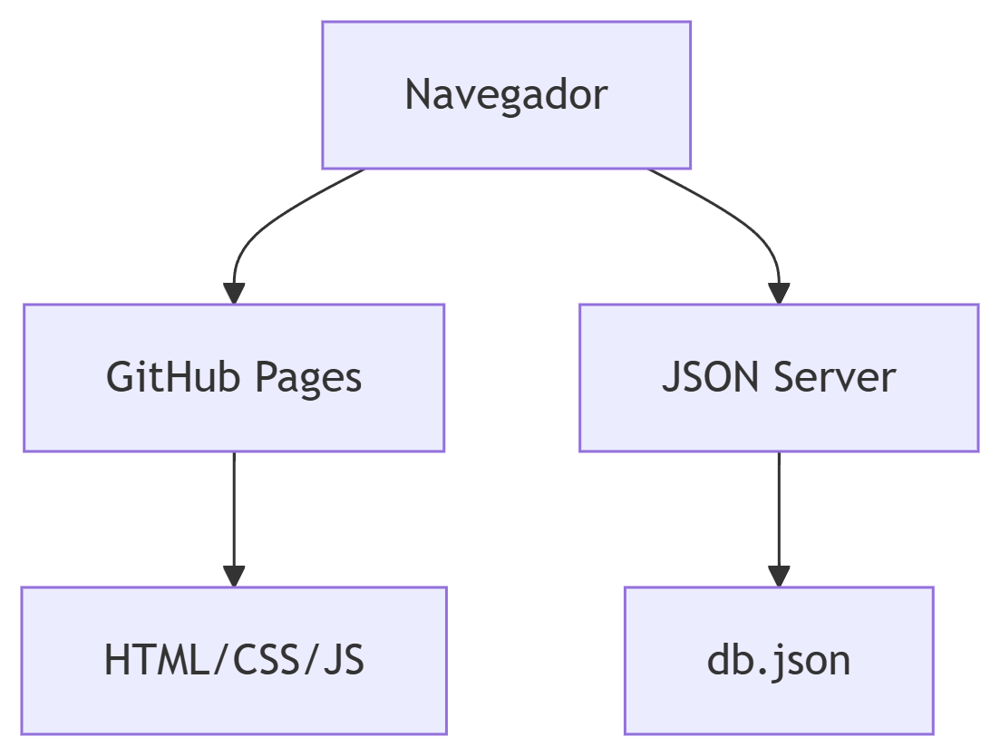
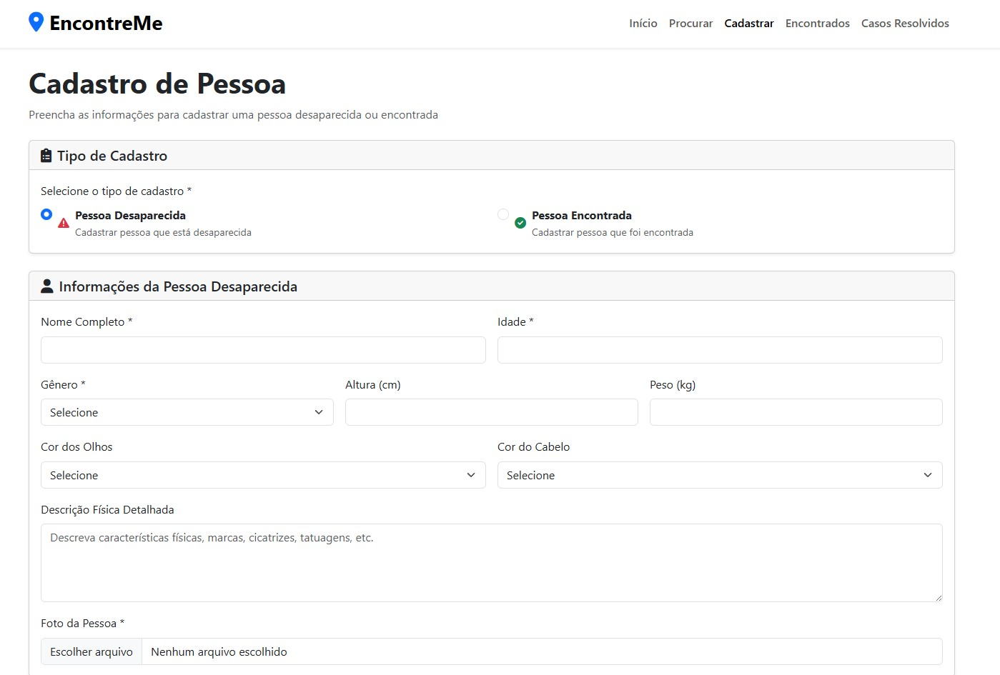
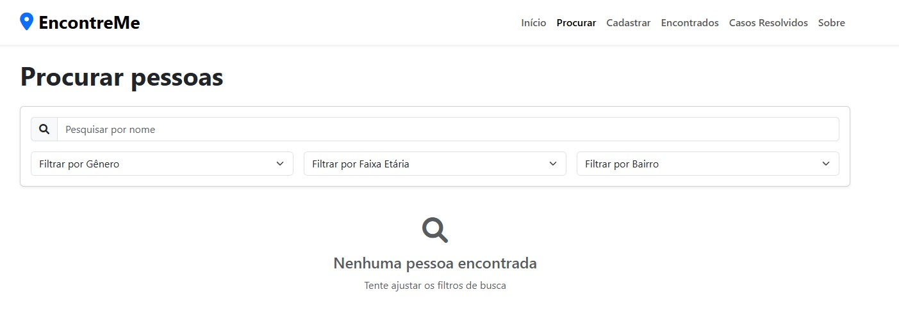
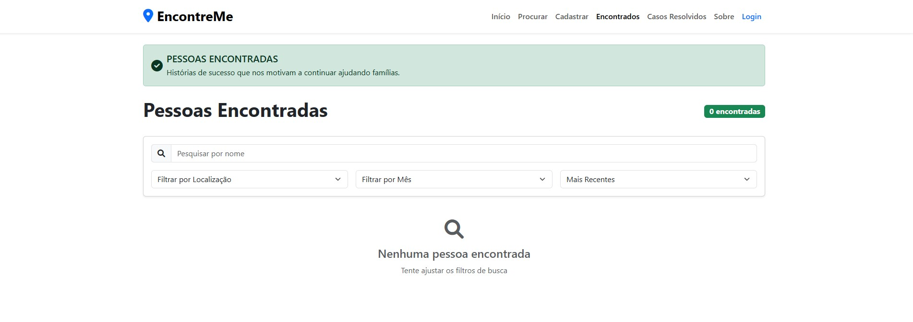
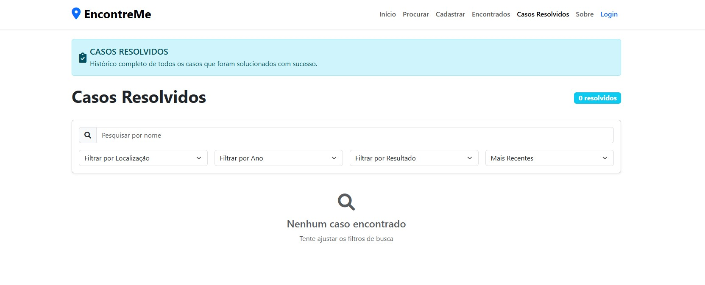

# Arquitetura da solução

<span style="color:red">Pré-requisitos: <a href="05-Projeto-interface.md"> Projeto de interface</a></span>

Definição de como o software é estruturado em termos dos componentes que fazem parte da solução e do ambiente de hospedagem da aplicação.



## Funcionalidades

Esta seção apresenta as funcionalidades da solução.

##### Funcionalidade 1 - Cadastro de Pessoas

Permite cadastrar pessoas desaparecidas ou encontradas com informações detalhadas e fotos

* **Estrutura de dados:** [Cadastro de Pessoas](#estrutura-de-dados---Desaparecidos)
* **Instruções de acesso:**
  * Acesse o menu principal e selecione "Cadastrar";
  * Escolha o tipo de registro (Desaparecida/Encontrada);
  * Preencha todos os campos obrigatórios.
  * Envie o formulário.
* **Tela da funcionalidade**:



##### Funcionalidade 2 - Busca de pessoas desaparecidas

Sistema de busca avançada com filtros por características físicas e localização

* **Estrutura de dados:** [Busca de pessoas](#estrutura-de-dados---Desaparecidos)
* **Instruções de acesso:**
  * Acesse a página "Procurar" no menu;
  * Utilize os filtros disponíveis;
  * Visualize os resultados na lista.
* **Tela da funcionalidade**:



##### Funcionalidade 3 - Autenticação

Sistema seguro de login e registro de usuários

* **Estrutura de dados:** [Autenticação](#estrutura-de-dados---Usuários)
* **Instruções de acesso:**
  * Acesse "Login" no menu;
  * Insira suas credenciais;
  * Para novos usuários, acesse "Registrar".
* **Tela da funcionalidade**:


##### Funcionalidade 4 - Visualização de Pessoas Encontradas

Exibe casos recentes de pessoas que foram localizadas com sucesso

* **Estrutura de dados:** [Pessoas Encontradas](#estrutura-de-dados---Encontrados)
* **Instruções de acesso:**
  * Acesse o menu principal e selecione "Encontrados";
  * Utilize os filtros para buscar casos específicos;
  * Visualize os detalhes de cada caso.
* **Tela da funcionalidade**:



##### Funcionalidade 5 - Visualização de Casos Resolvidos

Mostra estatísticas e históricos completos de casos solucionados

* **Estrutura de dados:** [Casos Resolvidos](#estrutura-de-dados---Resolvidos)
* **Instruções de acesso:**
  * Acesse o menu principal e selecione "Casos Resolvidos";
  * Filtre por localização, ano ou tipo de resultado;
  * Consulte as estatísticas gerais.
* **Tela da funcionalidade**:



### Estruturas de dados

Descrição das estruturas de dados utilizadas na solução com exemplos no formato JSON.Info.

##### Estrutura de dados - Desaparecidos

Dados das pessoas desaparecidas que são cadastradas

```json
  {
    "id": "1",
    "nome": "Emilio Jose",
    "idade": 63,
    "genero": "Masculino",
    "altura": "175cm",
    "localizacao": "Centro",
    "status": "desaparecida"
  }
  
```

##### Estrutura de dados - Usuários 

Sistema seguro de login e registro de usuários.

```json
  {
    "id": "1",
    "nome": "Admin Sistema",
    "email": "admin@encontreme.com",
    "telefone": "(31) 99999-9999",
    "senha": "123456",
    "dataRegistro": "2025-06-01",
    "ativo": true
  }
```

##### Estrutura de dados - Encontrados

Informações armazenadas e qeu devem ser fornecidas para pesquisar indivíduos encontrados.

```json
  {
    "id": "1",
    "nome": "João Pedro",
    "dataEncontrada": "2025-01-20",
    "diasDesaparecida": 5,
    "historia": "Encontrado em hospital após acidente"
  }
```

##### Estrutura de dados - Resolvidos

Informações armazenadas e qeu devem ser fornecidas para pesquisar casos resolvidos.

```json
  {
    "id": "1",
    "nome": "Carlos Mendes",
    "dataResolucao": "2025-01-25",
    "diasDesaparecida": 15,
    "resultado": "encontrado_seguro"
  }
```

### Módulos e APIs

Esta seção apresenta os módulos e APIs utilizados na solução.

**Images**:

* Unsplash - [https://unsplash.com/](https://unsplash.com/)

**Fonts:**

* Icons Font Face - [https://fontawesome.com/](https://fontawesome.com/)

**Scripts:**

* jQuery - [http://www.jquery.com/](http://www.jquery.com/)
* Bootstrap 5 - [http://getbootstrap.com/](http://getbootstrap.com/)


## Hospedagem

A hospedagem foi realizada via GitHub Pages, com backend simulado via JSON Server local.
https://icei-puc-minas-pbe-ads-si.github.io/2025-1-p1-tiaw-pessoas-desaparecidas/index.html
