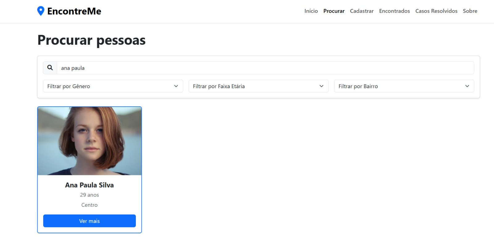

# Registro de testes de software

Pré-requisitos: <a href="05-Projeto-interface.md"> Projeto de interface</a>, <a href="08-Plano-testes-software.md"> Plano de testes de software</a>

Relatório com as evidências dos testes de software realizados no sistema pela equipe, baseado em um plano de testes pré-definido.

Para cada caso de teste definido no <a href="08-Plano-testes-software.md"> Plano de testes de software</a>, realize o registro das evidências dos testes feitos na aplicação pela equipe, que comprovem que o critério de êxito foi alcançado (ou não!). Para isso, utilize uma ferramenta de captura de tela que mostre cada um dos casos de teste definidos. Observação: cada caso de teste deverá possuir um vídeo do tipo _screencast_ para caracterizar uma evidência do referido caso.

| **Caso de teste**  | **CT-001 – Cadastrar pessoa desaparecida**  |
|:---: |:---: |
| Requisito associado | RF-001 - O sistema deve permitir o cadastro de pessoas desaparecidas com informações detalhadas. |
| Registro de evidência | 

| **Caso de teste**  | **CT-002 – Pesquisar pessoas desaparecidas**  |
|:---: |:---: |
| Requisito associado | RF-002 - O sistema deve permitir a busca de pessoas desaparecidas com filtros. |
| Registro de evidência | 

| **Caso de teste**  | **CT-003 – Registrar pessoa encontrada**  |
|:---: |:---: |
| Requisito associado | RF-003 - O sistema deve permitir o registro de pessoas encontradas. |
| Registro de evidência |

| **Caso de teste**  | **CT-004 – Visualizar casos resolvidos**  |
|:---: |:---: |
| Requisito associado | RF-004 - O sistema deve exibir estatísticas e históricos de casos resolvidos. |
| Registro de evidência |

| **Caso de teste**  | **CT-005 – Realizar login**  |
|:---: |:---: |
| Requisito associado | RF-005 - O sistema deve permitir o login de usuários cadastrados. |
| Registro de evidência |

| **Caso de teste**  | **CT-006 – Criar conta de usuário**  |
|:---: |:---: |
| Requisito associado | RF-006 - O sistema deve permitir o cadastro de novos usuários. |
| Registro de evidência |

> **Links úteis**:
> - [Screencast: entenda o que é e como gravar vídeos com ele](https://rockcontent.com/br/blog/screencast/) 

## Avaliação

Discorra sobre os resultados do teste, ressaltando os pontos fortes e fracos identificados na solução. Comente como o grupo pretende abordar esses pontos nas próximas iterações. Apresente as falhas detectadas e as melhorias geradas a partir dos resultados obtidos nos testes.

> **Links úteis**:
> - [Ferramentas de Teste para JavaScript](https://geekflare.com/javascript-unit-testing/)
